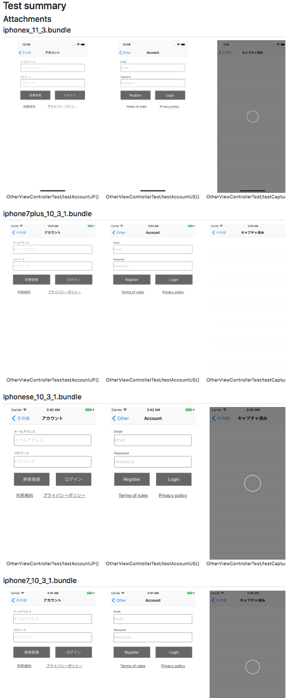

# TestSummaries

`TestSummaries` is able to generate HTML file from `TestSummaries.plist` to `--outputPath` on `Terminal` of osx.



# Install

## from homebrew

in `Terminal`

```sh
brew install fromkk/TestSummaries/testsummaries
```

## from source code

in `Terminal`

```sh
git clone git@github.com:fromkk/TestSummaries.git
cd ./TestSummaries
make install
```

# Usage

```sh
test-summaries [--resultDirectory <resultDirectory>] | [--bundlePath <bundlePath>] --outputPath <outputPath>
```

Options | Description
-------|--------------
--resultDirectory | set the directory path that has multiple test results
--bundlePath | set the bundle path for single test result
--outputPath | set the path for output the generated HTML file
